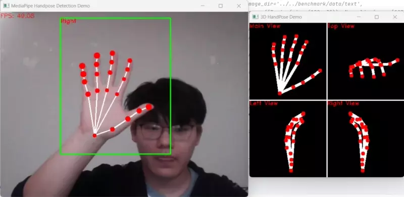
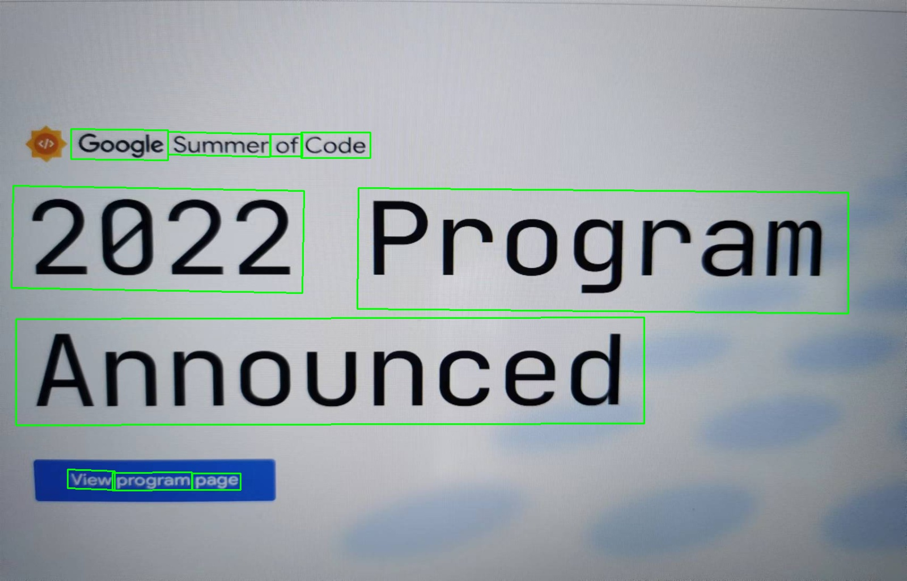

# OpenCV Zoo and Benchmark

A zoo for models tuned for OpenCV DNN with benchmarks on different platforms.

Guidelines:

- Install latest `opencv-python`:
  ```shell
  python3 -m pip install opencv-python
  # Or upgrade to latest version
  python3 -m pip install --upgrade opencv-python
  ```
- Clone this repo to download all models and demo scripts:
  ```shell
  # Install git-lfs from https://git-lfs.github.com/
  git clone https://github.com/opencv/opencv_zoo && cd opencv_zoo
  git lfs install
  git lfs pull
  ```
- To run benchmarks on your hardware settings, please refer to [benchmark/README](./benchmark/README.md).

## Models & Benchmark Results


Hardware Setup:

- `CPU-INTEL`: [Intel Core i7-12700K](https://www.intel.com/content/www/us/en/products/sku/134594/intel-core-i712700k-processor-25m-cache-up-to-5-00-ghz/specifications.html), 8 Performance-cores (3.60 GHz, turbo up to 4.90 GHz), 4 Efficient-cores (2.70 GHz, turbo up to 3.80 GHz), 20 threads.
- `CPU-RPI`: [Raspberry Pi 4B](https://www.raspberrypi.com/products/raspberry-pi-4-model-b/specifications/), Broadcom BCM2711, Quad core Cortex-A72 (ARM v8) 64-bit SoC @ 1.5 GHz.
- `GPU-JETSON`: [NVIDIA Jetson Nano B01](https://developer.nvidia.com/embedded/jetson-nano-developer-kit), 128-core NVIDIA Maxwell GPU.
- `NPU-KV3`: [Khadas VIM3](https://www.khadas.com/vim3), 5TOPS Performance. Benchmarks are done using **quantized** models. You will need to compile OpenCV with TIM-VX following [this guide](https://github.com/opencv/opencv/wiki/TIM-VX-Backend-For-Running-OpenCV-On-NPU) to run benchmarks. The test results use the `per-tensor` quantization model by default.
- `NPU-Ascend310`: [Ascend 310](https://e.huawei.com/uk/products/cloud-computing-dc/atlas/atlas-200), 22 TOPS @ INT8. Benchmarks are done on [Atlas 200 DK AI Developer Kit](https://e.huawei.com/in/products/cloud-computing-dc/atlas/atlas-200). Get the latest OpenCV source code and build following [this guide](https://github.com/opencv/opencv/wiki/Huawei-CANN-Backend) to enable CANN backend.
- `CPU-D1`: [Allwinner D1](https://d1.docs.aw-ol.com/en), [Xuantie C906 CPU](https://www.t-head.cn/product/C906?spm=a2ouz.12986968.0.0.7bfc1384auGNPZ) (RISC-V, RVV 0.7.1) @ 1.0 GHz, 1 core. YuNet is supported for now. Visit [here](https://github.com/fengyuentau/opencv_zoo_cpp) for more details.

***Important Notes***:

- The data under each column of hardware setups on the above table represents the elapsed time of an inference (preprocess, forward and postprocess).
- The time data is the mean of 10 runs after some warmup runs. Different metrics may be applied to some specific models.
- Batch size is 1 for all benchmark results.
- `---` represents the model is not availble to run on the device.
- View [benchmark/config](./benchmark/config) for more details on benchmarking different models.

## Some Examples

Some examples are listed below. You can find more in the directory of each model!

### Face Detection with [YuNet](./models/face_detection_yunet/)


### Facial Expression Recognition with [Progressive Teacher](./models/facial_expression_recognition/)


### Human Segmentation with [PP-HumanSeg](./models/human_segmentation_pphumanseg/)


### License Plate Detection with [LPD_YuNet](./models/license_plate_detection_yunet/)


### Object Detection with [NanoDet](./models/object_detection_nanodet/) & [YOLOX](./models/object_detection_yolox/)


### Object Tracking with [DaSiamRPN](./models/object_tracking_dasiamrpn/)


### Palm Detection with [MP-PalmDet](./models/palm_detection_mediapipe/)


### Hand Pose Estimation with [MP-HandPose](models/handpose_estimation_mediapipe/)



### QR Code Detection and Parsing with [WeChatQRCode](./models/qrcode_wechatqrcode/)


### Chinese Text detection [DB](./models/text_detection_db/)


### English Text detection [DB](./models/text_detection_db/)



### Text Detection with [CRNN](./models/text_recognition_crnn/)


## License

OpenCV Zoo is licensed under the [Apache 2.0 license](./LICENSE). Please refer to licenses of different models.
