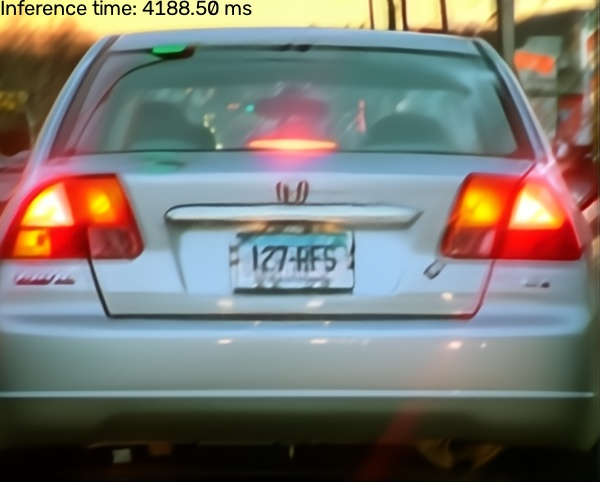

# NAFNet

NAFNet is a lightweight image deblurring model that eliminates nonlinear activations to achieve state-of-the-art performance with minimal computational cost.

Notes:

- Model source: [.pth](https://drive.google.com/file/d/14D4V4raNYIOhETfcuuLI3bGLB-OYIv6X/view).

## Requirements 
Install latest OpenCV >=5.0.0 and CMake >= 3.22.2 to get started with.

## Demo

### Python

Run the following command to try the demo:

```shell
# deblur the default input image
python demo.py
# deblur the user input image
python demo.py --input /path/to/image

# get help regarding various parameters
python demo.py --help
```

### C++

```shell
# A typical and default installation path of OpenCV is /usr/local
cmake -B build -D OPENCV_INSTALLATION_PATH=/path/to/opencv/installation .
cmake --build build

# deblur the default input image
./build/demo
# deblur the user input image
./build/demo --input=/path/to/image
# get help messages
./build/demo -h
```

### Example outputs



## License

All files in this directory are licensed under [MIT License](./LICENSE).

## Reference

- https://github.com/megvii-research/NAFNet