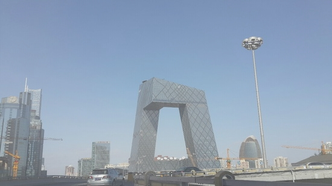
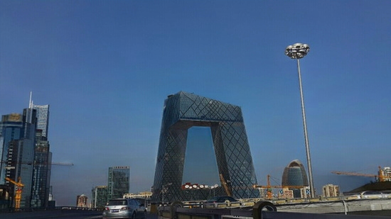
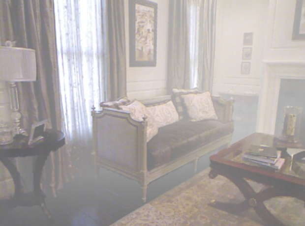
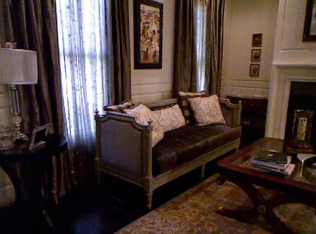
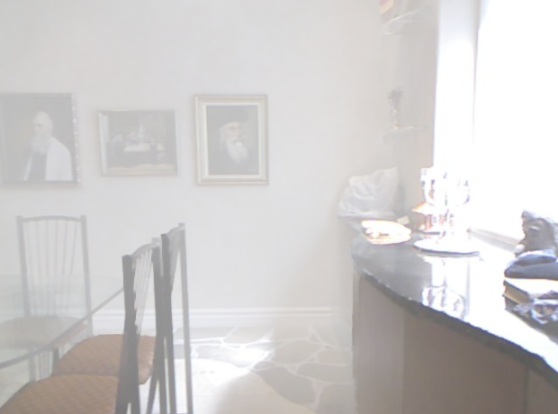
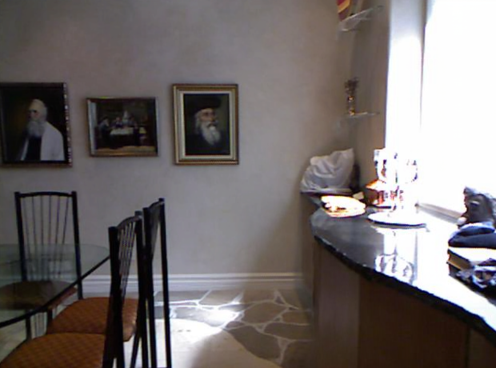
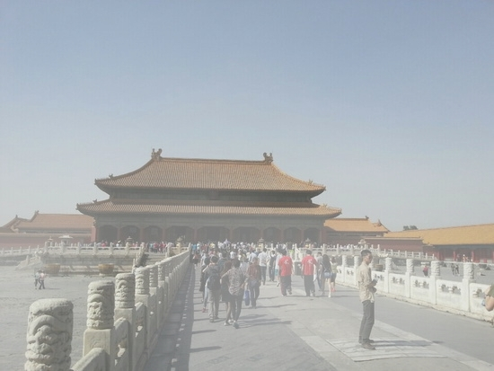
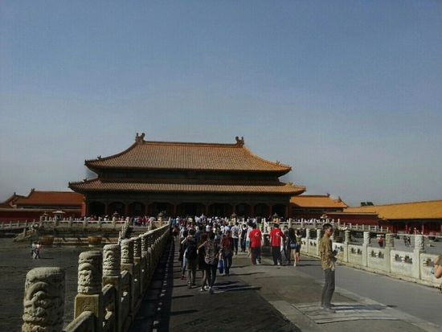

# MAXIM: Multi-Axis MLP for Image Processing (CVPR 2022 Oral)


Notes:
- The official implementation of MAXIM can be found [here](https://github.com/google-research/maxim)
- This ONNX model has fixed input shape (512*640), any image smaller than this will be padded with reflection mode, and any image larger than this will cause error.

## Demo

Run the following command to try the demo:
```shell
# detect on sample image 1
python demo.py
# detect on an image
python demo.py --input /path/to/image
```

### Example outputs











## License

All files in this directory are licensed under  [Apache 2.0 License](./LICENSE).

## Reference

https://github.com/google-research/maxim