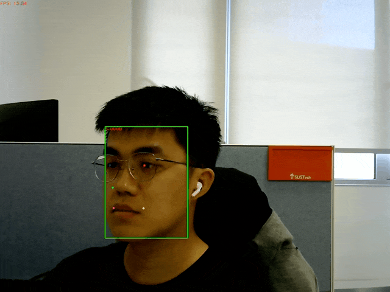
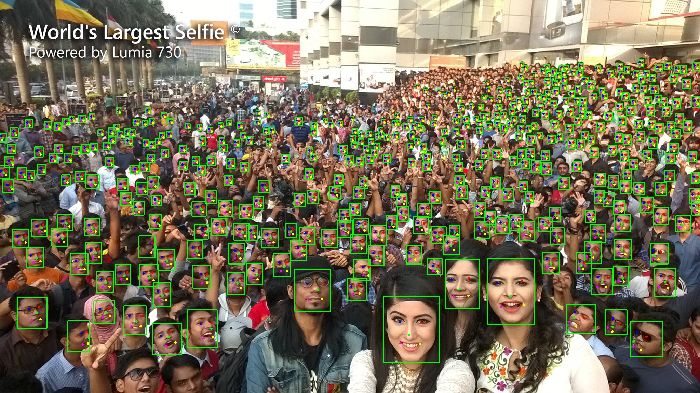

# YuNet

YuNet is a light-weight, fast and accurate face detection model, which achieves 0.834(AP_easy), 0.824(AP_medium), 0.708(AP_hard) on the WIDER Face validation set.

Notes:
- Model source: [here](https://github.com/ShiqiYu/libfacedetection.train/blob/a61a428929148171b488f024b5d6774f93cdbc13/tasks/task1/onnx/yunet.onnx).
- For details on training this model, please visit https://github.com/ShiqiYu/libfacedetection.train.
- This ONNX model has fixed input shape, but OpenCV DNN infers on the exact shape of input image. See https://github.com/opencv/opencv_zoo/issues/44 for more information.

Results of accuracy evaluation with [tools/eval](../../tools/eval).

| Models      | Easy AP | Medium AP | Hard AP | 
|-------------|---------|-----------|---------|
| YuNet       | 0.8498  | 0.8384    | 0.7357  |
| YuNet quant | 0.7751  | 0.8145    | 0.7312  |

\*: 'quant' stands for 'quantized'.

## Demo

Run the following command to try the demo:
```shell
# detect on camera input
python demo.py
# detect on an image
python demo.py --input /path/to/image
```

### Example outputs





## License

All files in this directory are licensed under [MIT License](./LICENSE).

## Reference

- https://github.com/ShiqiYu/libfacedetection
- https://github.com/ShiqiYu/libfacedetection.train
