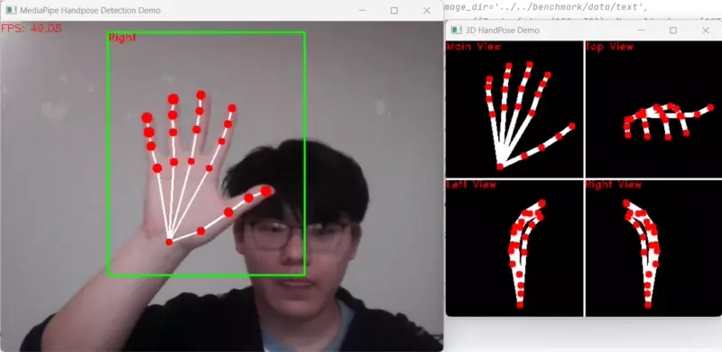

# Hand pose estimation from MediaPipe Handpose

This model estimates 21 hand keypoints per detected hand from [palm detector](../palm_detection_mediapipe). (The image below is referenced from [MediaPipe Hands Keypoints](https://github.com/tensorflow/tfjs-models/tree/master/hand-pose-detection#mediapipe-hands-keypoints-used-in-mediapipe-hands))
 


This model is converted from TFlite to ONNX using following tools:
- TFLite model to ONNX: https://github.com/onnx/tensorflow-onnx
- simplified by [onnx-simplifier](https://github.com/daquexian/onnx-simplifier)

**Note**:
- The int8-quantized model may produce invalid results due to a significant drop of accuracy.
- Visit https://google.github.io/mediapipe/solutions/models.html#hands for models of larger scale.

## Demo

Run the following commands to try the demo:
```bash
# detect on camera input
python demo.py
# detect on an image
python demo.py -i /path/to/image
```

### Example outputs



## License

All files in this directory are licensed under [Apache 2.0 License](./LICENSE).

## Reference

- MediaPipe Handpose: https://github.com/tensorflow/tfjs-models/tree/master/handpose
- MediaPipe hands model and model card: https://google.github.io/mediapipe/solutions/models.html#hands
- Int8 model quantized with rgb evaluation set of FreiHAND: https://lmb.informatik.uni-freiburg.de/resources/datasets/FreihandDataset.en.html
