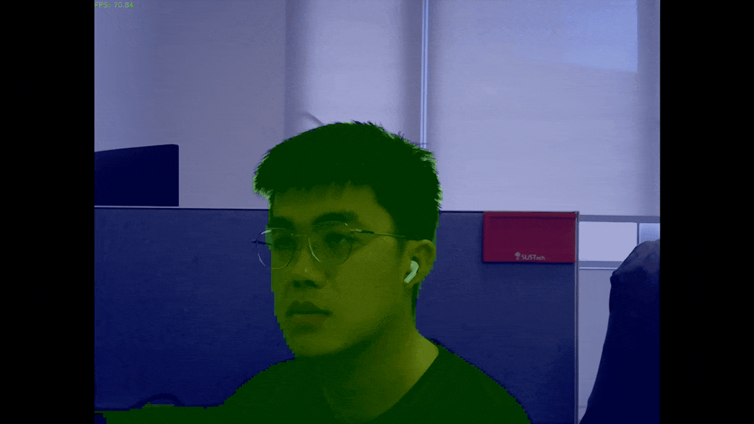

# PPHumanSeg

This model is ported from [PaddleHub](https://github.com/PaddlePaddle/PaddleHub) using [this script from OpenCV](https://github.com/opencv/opencv/blob/master/samples/dnn/dnn_model_runner/dnn_conversion/paddlepaddle/paddle_humanseg.py).

## Demo

Run the following command to try the demo:

```shell
# detect on camera input
python demo.py
# detect on an image
python demo.py --input /path/to/image

# get help regarding various parameters
python demo.py --help
```

### Example outputs




---
Results of accuracy evaluation with [tools/eval](../../tools/eval).

| Models             | Accuracy       | 
| ------------------ | -------------- |
| PPHumanSeg         | 0.9023         |
| PPHumanSeg quant   | 0.4940         |


\*: 'quant' stands for 'quantized'.

---
## License

All files in this directory are licensed under [Apache 2.0 License](./LICENSE).

## Reference

- https://arxiv.org/abs/1512.03385
- https://github.com/opencv/opencv/tree/master/samples/dnn/dnn_model_runner/dnn_conversion/paddlepaddle
- https://github.com/PaddlePaddle/PaddleHub
