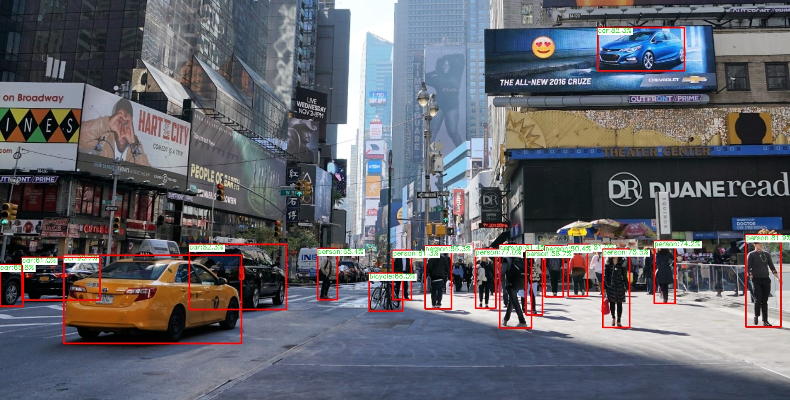
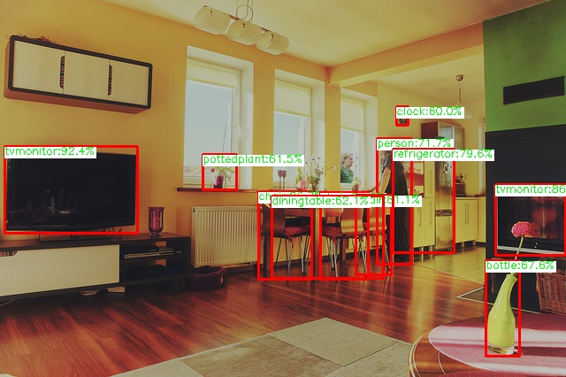

# YOLOX

Nanodet: YOLOX is an anchor-free version of YOLO, with a simpler design but better performance! It aims to bridge the gap between research and industrial communities. YOLOX is a high-performing object detector, an improvement to the existing YOLO series. YOLO series are in constant exploration of techniques to improve the object detection techniques for optimal speed and accuracy trade-off for real-time applications.

Key features of the YOLOX object detector
- **Anchor-free detectors** significantly reduce the number of design parameters
- **A decoupled head for classification, regression, and localization** improves the convergence speed
- **SimOTA advanced label assignment strategy** reduces training time and avoids additional solver hyperparameters
- **Strong data augmentations like MixUp and Mosiac** to boost YOLOX performance

#### Model metrics:
Average Precision and Recall values observed for COCO dataset classes are showed below 


##### YOLOX_S:
Average forward time: 5.53 ms, Average NMS time: 1.71 ms, Average inference time: 7.25 ms
<table>
<tr><th>Average Precision </th><th>Average Recall</th></tr>
<tr><td>

|  area  |  IoU  |  Average Precision(AP)  |
|:-------|:------|:------------------------|
|  all  |  0.50:0.95  |  0.405  |
|  all  |  0.50  |  0.593  |
|  all  |  0.75  |  0.437  |
|  small  |  0.50:0.95  |  0.232  |
|  medium  |  0.50:0.95  |  0.448  |
|  large  |  0.50:0.95  |  0.541  |

 </td><td>

  area  |  IoU  |  Average Recall(AR)  |
|:-------|:------|:----------------|
|  all  |  0.50:0.95  |  0.326  |
|  all  |  0.50:0.95  |  0.531  |
|  all  |  0.50:0.95 |  0.574  |
|  small  |  0.50:0.95  |  0.365  |
|  medium  |  0.50:0.95  |  0.634  |
|  large  |  0.50:0.95  |  0.724  |
</td></tr> </table>


##### YOLOX_tiny:
Average forward time: 2.07 ms, Average NMS time: 1.71 ms, Average inference time: 3.79 ms
<table>
<tr><th>Average Precision </th><th>Average Recall</th></tr>
<tr><td>

|  area  |  IoU  |  Average Precision(AP)  |
|:-------|:------|:------------------------|
|  all  |  0.50:0.95  |  0.328  |
|  all  |  0.50  |  0.504  |
|  all  |  0.75  |  0.346  |
|  small  |  0.50:0.95  |  0.139  |
|  medium  |  0.50:0.95  |  0.360  |
|  large  |  0.50:0.95  |  0.501  |

 </td><td>

  area  |  IoU  |  Average Recall(AR)  |
|:-------|:------|:----------------|
|  all  |  0.50:0.95  |  0.283  |
|  all  |  0.50:0.95  |  0.450  |
|  all  |  0.50:0.95 |  0.485  |
|  small  |  0.50:0.95  |  0.226  |
|  medium  |  0.50:0.95  |  0.550  |
|  large  |  0.50:0.95  |  0.687  |
</td></tr> </table>


##### YOLOX_nano:
Average forward time: 1.68 ms, Average NMS time: 1.64 ms, Average inference time: 3.31 ms
<table>
<tr><th>Average Precision </th><th>Average Recall</th></tr>
<tr><td>

|  area  |  IoU  |  Average Precision(AP)  |
|:-------|:------|:------------------------|
|  all  |  0.50:0.95  |  0.258  |
|  all  |  0.50  |  0.414  |
|  all  |  0.75  |  0.268  |
|  small  |  0.50:0.95  |  0.082  |
|  medium  |  0.50:0.95  |  0.275  |
|  large  |  0.50:0.95  |  0.410  |

 </td><td>

  area  |  IoU  |  Average Recall(AR)  |
|:-------|:------|:----------------|
|  all  |  0.50:0.95  |  0.241  |
|  all  |  0.50:0.95  |  0.384  |
|  all  |  0.50:0.95 |  0.420  |
|  small  |  0.50:0.95  |  0.157  |
|  medium  |  0.50:0.95  |  0.473  |
|  large  |  0.50:0.95  |  0.631  |
</td></tr> </table>


## Demo

Run the following command to try the demo: 
```shell
# Nanodet inference on image input
python demo.py --model /path/to/model/ --input_type image --image_path /path/to/image/

# Nanodet inference on video input
python demo.py --model /path/to/model/ --input_type video 

#Saving outputs 
#Image output
python demo.py --model /path/to/model/ --input_type image --image_path /path/to/image/ --save True

#Video output
python demo.py --model /path/to/model/ --input_type video --save True

other parameters 
--confidence: Confidence values of the predictions (default: 0.5)
--nms: NMS threshold value for predictions (default: 0.5)
--obj: Object threshold value (default: 0.5)
```
Note: 
- By default input_type: image
- image result saved as "result.jpg"
- webcam result saved as "Webcam_result.mp4"


## Results

Here are some of the sample results that were observed using the model (**yolox_s.onnx**),

<p float="left">
  
  
</p>
  
Video inference result,
<p align="center">
  
</p>
  

## License

All files in this directory are licensed under [Apache 2.0 License](./LICENSE).


## Reference

- YOLOX article: https://arxiv.org/abs/2107.08430
- YOLOX weight and scripts for training: https://github.com/Megvii-BaseDetection/YOLOX
- YOLOX blog: https://arshren.medium.com/yolox-new-improved-yolo-d430c0e4cf20
- YOLOX-lite: https://github.com/TexasInstruments/edgeai-yolox


#### Note:

- In this repo we have used the following versions of YOLOX: YOLOX_S, YOLOX_tiny, YOLOX_nano
- The model was trained on COCO 2017 dataset, link to dataset: https://cocodataset.org/#download
- Below, we have per class AP results on COCO dataset for the models YOLOX_S, YOLOX_tiny, YOLOX_nano respectively

##### YOLOX_S
| class         | AP     | class        | AP     | class          | AP     |
|:--------------|:-------|:-------------|:-------|:---------------|:-------|
| person        | 54.109 | bicycle      | 31.580 | car            | 40.447 |
| motorcycle    | 43.477 | airplane     | 66.070 | bus            | 64.183 |
| train         | 64.483 | truck        | 35.110 | boat           | 24.681 |
| traffic light | 25.068 | fire hydrant | 64.382 | stop sign      | 65.333 |
| parking meter | 48.439 | bench        | 22.653 | bird           | 33.324 |
| cat           | 66.394 | dog          | 60.096 | horse          | 58.080 |
| sheep         | 49.456 | cow          | 53.596 | elephant       | 65.574 |
| bear          | 70.541 | zebra        | 66.461 | giraffe        | 66.780 |
| backpack      | 13.095 | umbrella     | 41.614 | handbag        | 12.865 |
| tie           | 29.453 | suitcase     | 39.089 | frisbee        | 61.712 |
| skis          | 21.623 | snowboard    | 31.326 | sports ball    | 39.820 |
| kite          | 41.410 | baseball bat | 27.311 | baseball glove | 36.661 |
| skateboard    | 49.374 | surfboard    | 35.524 | tennis racket  | 45.569 |
| bottle        | 37.270 | wine glass   | 33.088 | cup            | 39.835 |
| fork          | 31.620 | knife        | 15.265 | spoon          | 14.918 |
| bowl          | 43.251 | banana       | 27.904 | apple          | 17.630 |
| sandwich      | 32.789 | orange       | 29.388 | broccoli       | 23.187 |
| carrot        | 23.114 | hot dog      | 33.716 | pizza          | 52.541 |
| donut         | 47.980 | cake         | 36.160 | chair          | 29.707 |
| couch         | 46.175 | potted plant | 24.781 | bed            | 44.323 |
| dining table  | 30.022 | toilet       | 64.237 | tv             | 57.301 |
| laptop        | 58.362 | mouse        | 57.774 | remote         | 24.271 |
| keyboard      | 48.020 | cell phone   | 32.376 | microwave      | 57.220 |
| oven          | 36.168 | toaster      | 28.735 | sink           | 38.159 |
| refrigerator  | 52.876 | book         | 15.030 | clock          | 48.622 |
| vase          | 37.013 | scissors     | 26.307 | teddy bear     | 45.676 |
| hair drier    | 7.255  | toothbrush   | 19.374 |                |        |


##### YOLOX_tiny
| class         | AP     | class        | AP     | class          | AP     |
|:--------------|:-------|:-------------|:-------|:---------------|:-------|
| person        | 45.685 | bicycle      | 22.797 | car            | 29.265 |
| motorcycle    | 37.980 | airplane     | 59.446 | bus            | 54.878 |
| train         | 62.459 | truck        | 26.850 | boat           | 16.724 |
| traffic light | 17.527 | fire hydrant | 55.155 | stop sign      | 57.120 |
| parking meter | 37.755 | bench        | 17.656 | bird           | 24.382 |
| cat           | 55.792 | dog          | 50.964 | horse          | 49.806 |
| sheep         | 39.894 | cow          | 42.855 | elephant       | 58.863 |
| bear          | 62.345 | zebra        | 58.389 | giraffe        | 62.362 |
| backpack      | 8.131  | umbrella     | 33.650 | handbag        | 7.777  |
| tie           | 21.907 | suitcase     | 25.593 | frisbee        | 48.975 |
| skis          | 16.941 | snowboard    | 19.409 | sports ball    | 30.718 |
| kite          | 33.956 | baseball bat | 17.912 | baseball glove | 28.793 |
| skateboard    | 38.253 | surfboard    | 28.329 | tennis racket  | 33.240 |
| bottle        | 23.872 | wine glass   | 20.386 | cup            | 26.962 |
| fork          | 21.025 | knife        | 8.434  | spoon          | 6.513  |
| bowl          | 34.706 | banana       | 24.050 | apple          | 12.745 |
| sandwich      | 28.046 | orange       | 24.216 | broccoli       | 18.579 |
| carrot        | 16.283 | hot dog      | 30.058 | pizza          | 44.371 |
| donut         | 35.957 | cake         | 29.765 | chair          | 22.070 |
| couch         | 41.221 | potted plant | 19.856 | bed            | 44.173 |
| dining table  | 29.000 | toilet       | 60.369 | tv             | 49.868 |
| laptop        | 48.858 | mouse        | 47.843 | remote         | 14.349 |
| keyboard      | 42.412 | cell phone   | 23.536 | microwave      | 51.839 |
| oven          | 32.384 | toaster      | 24.209 | sink           | 32.607 |
| refrigerator  | 50.156 | book         | 9.534  | clock          | 41.661 |
| vase          | 25.548 | scissors     | 17.612 | teddy bear     | 39.375 |
| hair drier    | 0.000  | toothbrush   | 9.933  |                |        |


##### YOLOX_nano
| class         | AP     | class        | AP     | class          | AP     |
|:--------------|:-------|:-------------|:-------|:---------------|:-------|
| person        | 38.444 | bicycle      | 16.922 | car            | 21.708 |
| motorcycle    | 30.753 | airplane     | 47.573 | bus            | 49.651 |
| train         | 55.302 | truck        | 20.294 | boat           | 11.919 |
| traffic light | 12.026 | fire hydrant | 48.798 | stop sign      | 52.446 |
| parking meter | 33.439 | bench        | 13.565 | bird           | 16.520 |
| cat           | 42.603 | dog          | 43.831 | horse          | 37.338 |
| sheep         | 27.807 | cow          | 33.155 | elephant       | 52.374 |
| bear          | 49.737 | zebra        | 52.259 | giraffe        | 56.445 |
| backpack      | 5.456  | umbrella     | 25.288 | handbag        | 2.802  |
| tie           | 17.110 | suitcase     | 17.757 | frisbee        | 40.878 |
| skis          | 13.245 | snowboard    | 11.443 | sports ball    | 22.310 |
| kite          | 28.107 | baseball bat | 10.295 | baseball glove | 20.294 |
| skateboard    | 28.285 | surfboard    | 19.142 | tennis racket  | 25.253 |
| bottle        | 15.064 | wine glass   | 13.412 | cup            | 19.357 |
| fork          | 13.384 | knife        | 4.276  | spoon          | 3.460  |
| bowl          | 26.615 | banana       | 18.067 | apple          | 9.672  |
| sandwich      | 22.817 | orange       | 23.574 | broccoli       | 14.710 |
| carrot        | 10.180 | hot dog      | 18.646 | pizza          | 38.244 |
| donut         | 24.204 | cake         | 21.330 | chair          | 14.644 |
| couch         | 33.018 | potted plant | 13.252 | bed            | 38.034 |
| dining table  | 24.287 | toilet       | 52.986 | tv             | 44.978 |
| laptop        | 44.130 | mouse        | 35.173 | remote         | 7.349  |
| keyboard      | 33.903 | cell phone   | 19.140 | microwave      | 38.800 |
| oven          | 25.890 | toaster      | 10.665 | sink           | 23.293 |
| refrigerator  | 42.697 | book         | 6.942  | clock          | 35.254 |
| vase          | 18.742 | scissors     | 11.866 | teddy bear     | 30.907 |
| hair drier    | 0.000  | toothbrush   | 7.284  |                |        |


#### Contributor Details

- Google Summer of Code'22
- Contributor: Sri Siddarth Chakaravarthy
- Github Profile: https://github.com/Sidd1609
- Organisation: OpenCV
- Project: Lightweight object detection models using OpenCV 

