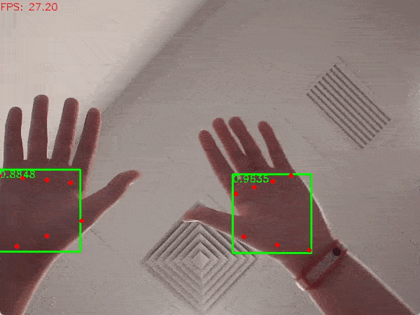

# Palm detector from MediaPipe Handpose

This model detects palm bounding boxes and palm landmarks, and is converted from Tensorflow-JS to ONNX using following tools:
- tfjs to tf_saved_model:  https://github.com/patlevin/tfjs-to-tf/
- tf_saved_model to ONNX: https://github.com/onnx/tensorflow-onnx
- simplified by [onnx-simplifier](https://github.com/daquexian/onnx-simplifier)

Also note that the model is quantized in per-channel mode with [Intel's neural compressor](https://github.com/intel/neural-compressor), which gives better accuracy but may lose some speed.

## Demo

Run the following commands to try the demo:
```bash
# detect on camera input
python demo.py
# detect on an image
python demo.py -i /path/to/image
```

### Example outputs



## License

All files in this directory are licensed under [Apache 2.0 License](./LICENSE).

## Reference

- MediaPipe Handpose: https://github.com/tensorflow/tfjs-models/tree/master/handpose
