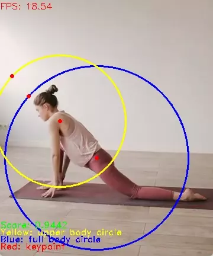

# Person detector from MediaPipe Pose

This model detects upper body and full body keypoints of a person, and is downloaded from https://github.com/PINTO0309/PINTO_model_zoo/blob/main/053_BlazePose/20_densify_pose_detection/download.sh or converted from TFLite to ONNX using following tools:

- TFLite model to ONNX with MediaPipe custom `densify` op: https://github.com/PINTO0309/tflite2tensorflow
- simplified by [onnx-simplifier](https://github.com/daquexian/onnx-simplifier)

SSD Anchors are generated from [GenMediaPipePalmDectionSSDAnchors](https://github.com/VimalMollyn/GenMediaPipePalmDectionSSDAnchors)

## Demo

Run the following commands to try the demo:

```bash
# detect on camera input
python demo.py
# detect on an image
python demo.py -i /path/to/image

# get help regarding various parameters
python demo.py --help
```

### Example outputs



## License

All files in this directory are licensed under [Apache 2.0 License](LICENSE).

## Reference
- MediaPipe Pose: https://google.github.io/mediapipe/solutions/pose
- MediaPipe pose model and model card: https://google.github.io/mediapipe/solutions/models.html#pose
- BlazePose TFJS: https://github.com/tensorflow/tfjs-models/tree/master/pose-detection/src/blazepose_tfjs
