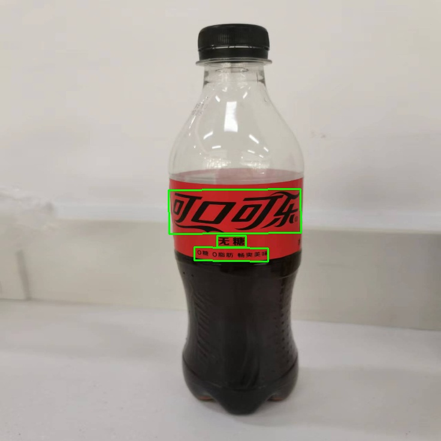

# PP-OCRv2 detect

Real-time Scene Text Detection with Differentiable Binarization

This model is ported from [PaddleOCR](https://github.com/PaddlePaddle/PaddleOCR).

## Demo

Run the following command to try the demo:
```shell
# detect on camera input
python demo.py
# detect on an image
python demo.py --input /path/to/image
```
### Example outputs




## License

All files in this directory are licensed under [Apache 2.0 License](./LICENSE).

## Reference

- https://arxiv.org/abs/1911.08947
- https://github.com/PaddlePaddle/PaddleOCR
- https://github.com/BADBADBADBOY/DBnet-lite.pytorch
- https://docs.opencv.org/master/d4/d43/tutorial_dnn_text_spotting.html