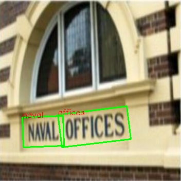

# CRNN

An End-to-End Trainable Neural Network for Image-based Sequence Recognition and Its Application to Scene Text Recognition

Results of accuracy evaluation with [tools/eval](../../tools/eval) at different text recognition datasets.

| Model name   | ICDAR03(%) | IIIT5k(%) | CUTE80(%) |
| ------------ | ---------- | --------- | --------- |
| CRNN_EN      | 81.66      | 74.33     | 52.78     |
| CRNN_EN_FP16 | 82.01      | 74.93     | 52.34     |
| CRNN_EN_INT8 | 81.75      | 75.33     | 52.43     |
| CRNN_CH      | 71.28      | 80.90     | 67.36     |
| CRNN_CH_FP16 | 78.63      | 80.93     | 67.01     |
| CRNN_CH_INT8 | 78.11      | 81.20     | 67.01     |

\*: 'FP16' or 'INT8' stands for 'model quantized into FP16' or 'model quantized into int8'

Note:

- Model source:
  - `text_recognition_CRNN_EN_2021sep.onnx`: https://docs.opencv.org/4.5.2/d9/d1e/tutorial_dnn_OCR.html (CRNN_VGG_BiLSTM_CTC.onnx)
  - `text_recognition_CRNN_CH_2021sep.onnx`: https://docs.opencv.org/4.x/d4/d43/tutorial_dnn_text_spotting.html (crnn_cs.onnx)
  - `text_recognition_CRNN_CN_2021nov.onnx`: https://docs.opencv.org/4.5.2/d4/d43/tutorial_dnn_text_spotting.html (crnn_cs_CN.onnx)
- `text_recognition_CRNN_EN_2021sep.onnx` can detect digits (0\~9) and letters (return lowercase letters a\~z) (view `charset_36_EN.txt` for details).
- `text_recognition_CRNN_CH_2021sep.onnx` can detect digits (0\~9), upper/lower-case letters (a\~z and A\~Z), and some special characters (view `charset_94_CH.txt` for details).
- `text_recognition_CRNN_CN_2021nov.onnx` can detect digits (0\~9), upper/lower-case letters (a\~z and A\~Z), some Chinese characters and some special characters (view `charset_3944_CN.txt` for details).
- For details on training this model series, please visit https://github.com/zihaomu/deep-text-recognition-benchmark.

## Demo

***NOTE***:

- This demo uses [text_detection_db](../text_detection_db) as text detector.
- Selected model must match with the charset:
  - Try `text_recognition_CRNN_EN_2021sep.onnx` with `charset_36_EN.txt`.
  - Try `text_recognition_CRNN_CH_2021sep.onnx` with `charset_94_CH.txt`
  - Try `text_recognition_CRNN_CN_2021sep.onnx` with `charset_3944_CN.txt`.

Run the demo detecting English:

```shell
# detect on camera input
python demo.py
# detect on an image
python demo.py --input /path/to/image

# get help regarding various parameters
python demo.py --help
```

Run the demo detecting Chinese:

```shell
# detect on camera input
python demo.py --model text_recognition_CRNN_CN_2021nov.onnx --charset charset_3944_CN.txt
# detect on an image
python demo.py --input /path/to/image --model text_recognition_CRNN_CN_2021nov.onnx --charset charset_3944_CN.txt

# get help regarding various parameters
python demo.py --help
```

### Examples




## License

All files in this directory are licensed under [Apache 2.0 License](./LICENSE).

## Reference

- https://arxiv.org/abs/1507.05717
- https://github.com/bgshih/crnn
- https://github.com/meijieru/crnn.pytorch
- https://github.com/zihaomu/deep-text-recognition-benchmark
- https://docs.opencv.org/4.5.2/d9/d1e/tutorial_dnn_OCR.html
