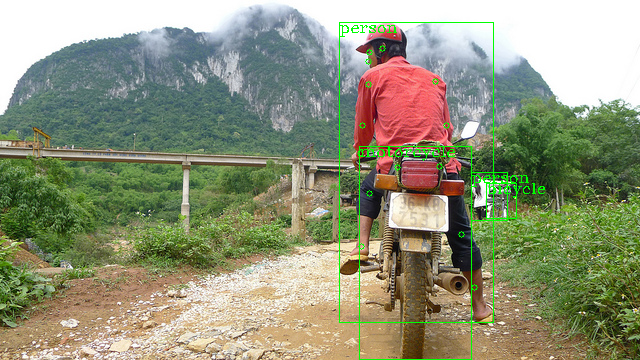
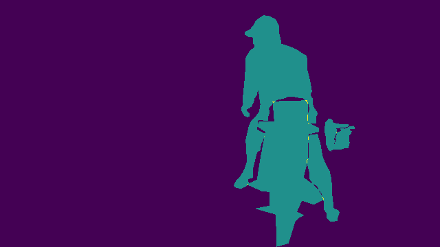

# MCN

Multitask-Centernet (MCN)  is a multi-task network (MTN). Studies have shown that training with multiple tasks linked to each other can sometimes even improve the quality of training and prediction compared to single-task learning (STL). When the network receives the same type of input, it is likely to extract similar features. In this case, a shared backbone can take advantage of the similar semantics of these input features.

Notes:
- Model source: [here](https://github.com/ShiqiYu/libfacedetection.train/blob/a61a428929148171b488f024b5d6774f93cdbc13/tasks/task1/onnx/yunet.onnx).
- For details on training this model, please visit my home page
- This ONNX model has fixed input shape, but OpenCV DNN infers on the exact shape of input image. See https://github.com/opencv/opencv_zoo/issues/63 for more information.

## Demo

Run the following command to try the demo:
```shell
# detect on camera input
python demo.py
# detect on an image
python demo.py --input /path/to/image
```

### Example outputs





## License

All files in this directory are licensed under [MIT License](./LICENSE).

## Reference

- https://arxiv.org/abs/2108.05060v2